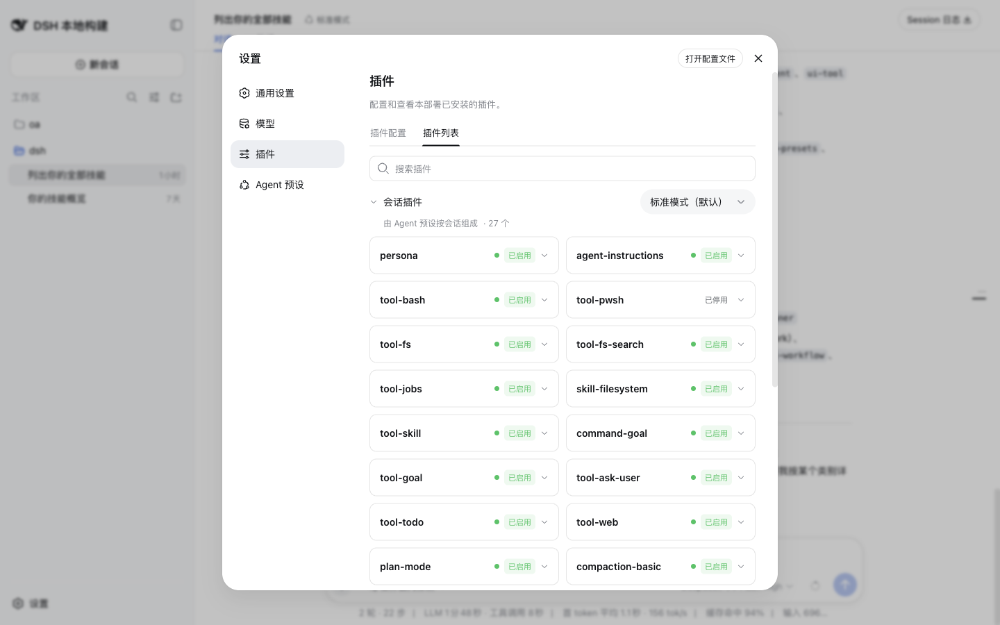

# client-ui-settings-plugins 使用指南

## Summary

`@deepseek-ai/dsh-client-ui-settings-plugins` 提供插件设置区，承载功能插件自己的 tab 和 host-plane 插件卡片。

## 适用场景

- 用户需要从设置页进入插件相关配置。
- 功能插件需要在插件设置区展示自己的卡片或 tab。

## 启用与启动

该插件不需要通过独立的 `dsh plugin add` 命令启用；当前 Web app 组合会按 Cordis 配置提供它的入口或挂载记录。inventory 记录的入口是 `packages/client/ui-settings-plugins/src/index.ts:11; mounted by packages/bundle/web-app/cordis.patch.yml:296`。

本地验证使用已有服务：

```sh
pnpm dsh web --no-open --port 3080
```

启动后，用带 CDP `127.0.0.1:9333` 的 Chrome 打开 `http://127.0.0.1:3080/`。普通 `curl -I` 没有浏览器凭据时会返回 `401`，因此页面验证以已认证 Chrome target 为准。

## 实际使用

1. 打开设置面板。
2. 查看“插件”导航入口。
3. 进入插件设置区域后观察插件清单或插件卡片。

## 可观察结果

设置导航显示“插件”，并已有插件设置/清单分类截图资产；设置页采样 clean。

## 验证证据

- 静态范围：`/tmp/dsh-plugin-usage-evidence/plugin-inventory.json` 中 `client-ui-settings-plugins` 的 `category` 为 `client-ui`，`exclusionReason` 为 `null`，文档目标为 `docs/plugin/usage/client-ui/client-ui-settings-plugins.md`。
- 页面采样：`/tmp/dsh-plugin-usage-evidence/verification-ui-host-api.md` 的 Client UI 表记录“设置导航显示“插件”；已有插件设置/清单分类截图资产。”。
- 服务基线：`/tmp/dsh-plugin-usage-evidence/service-baseline.md` 记录服务 URL、Chrome CDP target、页面 load 和 clean console/network 结果。
- 截图引用：。
- 证据编号：E5；E9；console/network 结论：设置页 clean；E9 只作为截图资产，不附带独立 console/network 采样。

## 限制与故障排查

本轮没有编辑插件设置。若插件卡片缺失，先核对该功能插件是否向 settings-plugins 注册了卡片。

Task 3 对该插件记录的限制是：未编辑插件设置。
