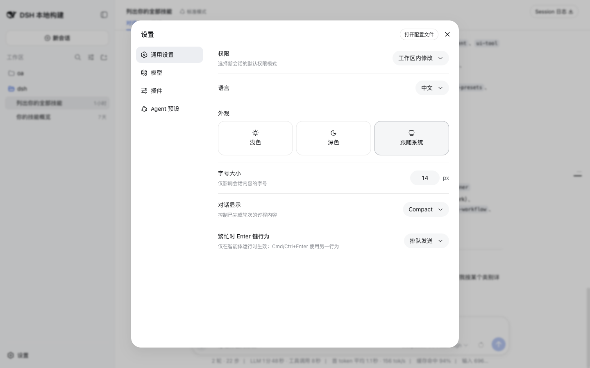

# client-ui-theme 使用指南

## Summary

`@deepseek-ai/dsh-client-ui-theme` 提供浅色、深色、跟随系统主题状态，以及 `--dsw-*` token 样式。

## 适用场景

- 用户需要查看或调整 Web 外观主题。
- 排查主题 token 是否让页面正常渲染。

## 启用与启动

该插件不需要通过独立的 `dsh plugin add` 命令启用；当前 Web app 组合会按 Cordis 配置提供它的入口或挂载记录。inventory 记录的入口是 `packages/client/ui-theme/src/index.ts:36; mounted by packages/bundle/web-app/cordis.patch.yml:178`。

本地验证使用已有服务：

```sh
pnpm dsh web --no-open --port 3080
```

启动后，用带 CDP `127.0.0.1:9333` 的 Chrome 打开 `http://127.0.0.1:3080/`。普通 `curl -I` 没有浏览器凭据时会返回 `401`，因此页面验证以已认证 Chrome target 为准。

## 实际使用

1. 打开设置面板。
2. 进入默认的“通用设置”。
3. 查看外观设置中的浅色、深色、跟随系统选项。

## 可观察结果

设置通用页显示浅色、深色、跟随系统主题选择，当前页面使用主题样式正常渲染；设置页采样 clean。

## 验证证据

- 静态范围：`/tmp/dsh-plugin-usage-evidence/plugin-inventory.json` 中 `client-ui-theme` 的 `category` 为 `client-ui`，`exclusionReason` 为 `null`，文档目标为 `docs/plugin/usage/client-ui/client-ui-theme.md`。
- 页面采样：`/tmp/dsh-plugin-usage-evidence/verification-ui-host-api.md` 的 Client UI 表记录“设置通用页显示浅色、深色、跟随系统主题选择；当前页面使用主题样式正常渲染。”。
- 服务基线：`/tmp/dsh-plugin-usage-evidence/service-baseline.md` 记录服务 URL、Chrome CDP target、页面 load 和 clean console/network 结果。
- 截图引用：。
- 证据编号：E5；E6；console/network 结论：设置页 clean。

## 限制与故障排查

本轮没有切换主题。若主题没有生效，先检查 host bootstrap 的主题状态和 CSS token 注入。

Task 3 对该插件记录的限制是：未切换主题。
