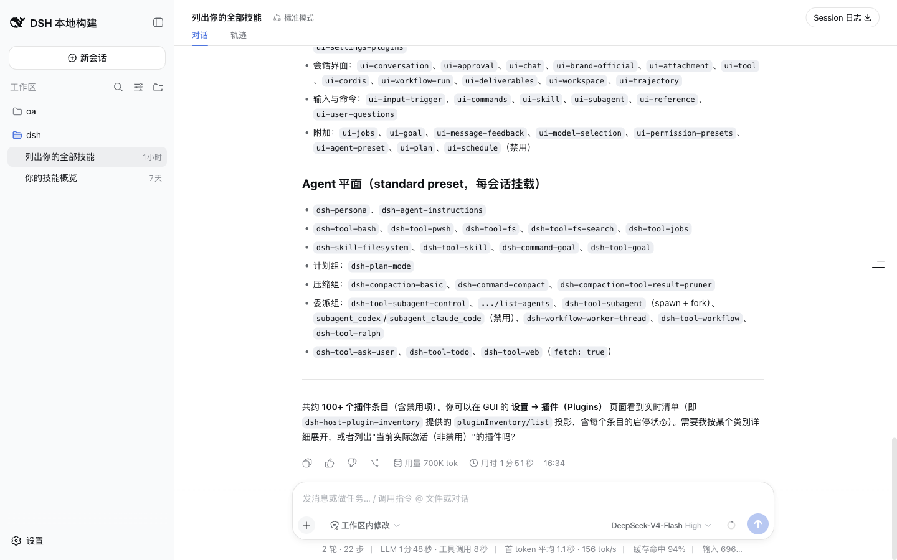

# client-ui-workspace 使用指南

## Summary

`@deepseek-ai/dsh-client-ui-workspace` 在侧栏和空状态中提供 workspace picker，让用户查看或切换工作区。

## 适用场景

- 用户需要在 Web 侧栏查看当前 workspace 分组。
- 排查 workspace picker 是否接入侧栏。

## 启用与启动

该插件不需要通过独立的 `dsh plugin add` 命令启用；当前 Web app 组合会按 Cordis 配置提供它的入口或挂载记录。inventory 记录的入口是 `packages/client/ui-workspace/src/index.ts:9; mounted by packages/bundle/web-app/cordis.patch.yml:242`。

本地验证使用已有服务：

```sh
pnpm dsh web --no-open --port 3080
```

启动后，用带 CDP `127.0.0.1:9333` 的 Chrome 打开 `http://127.0.0.1:3080/`。普通 `curl -I` 没有浏览器凭据时会返回 `401`，因此页面验证以已认证 Chrome target 为准。

## 实际使用

1. 打开本地 Web 服务。
2. 查看左侧侧栏的“工作区”区域。
3. 确认 workspace 分组和操作按钮可见。

## 可观察结果

侧边栏 workspace 分组和 workspace 操作按钮可见；首页采样 clean。

## 验证证据

- 静态范围：`/tmp/dsh-plugin-usage-evidence/plugin-inventory.json` 中 `client-ui-workspace` 的 `category` 为 `client-ui`，`exclusionReason` 为 `null`，文档目标为 `docs/plugin/usage/client-ui/client-ui-workspace.md`。
- 页面采样：`/tmp/dsh-plugin-usage-evidence/verification-ui-host-api.md` 的 Client UI 表记录“侧边栏 workspace 分组和 workspace 操作按钮可见。”。
- 服务基线：`/tmp/dsh-plugin-usage-evidence/service-baseline.md` 记录服务 URL、Chrome CDP target、页面 load 和 clean console/network 结果。
- 截图引用：。
- 证据编号：E2；E3；console/network 结论：首页 clean。

## 限制与故障排查

本轮没有新增或切换 workspace。若 workspace 区域为空，先检查 api-workspace-controller 和 workspace picker 注册。

Task 3 对该插件记录的限制是：未新增或切换 workspace。
